# 记录我的中国行 · Chinese Footprint

> 记录一座城，也记录那时的自己。

点亮到访城市，收藏旅途照片，用地图、时间轴和相册回看自己的中国行。

[在线体验](https://zwxll.github.io/Your-China-Travel/) · [开发与部署](docs/DEVELOPMENT.md) · [项目交接](项目交接文档.md)

抖音号详细介绍：Vvxxx1223

## 界面预览

点击图片查看大图；动态交互请进入在线体验。截图展示本地版本，最新功能不一定已发布。

| 中国足迹 | 城市画廊 |
| :---: | :---: |
| [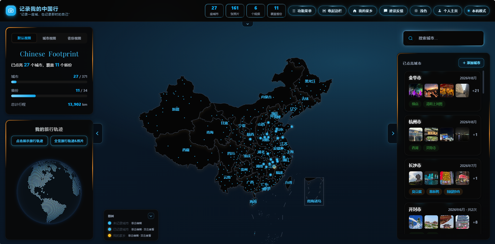](docs/images/china-map.png) | [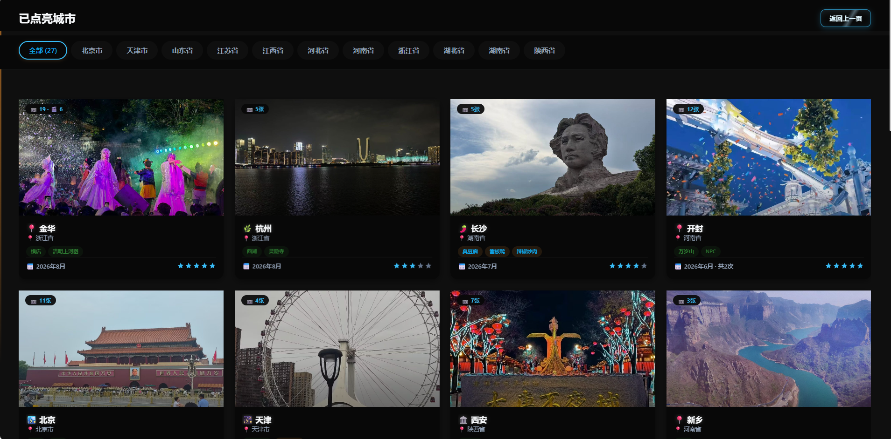](docs/images/city-gallery.png) |
| 在地图上点亮城市，查看照片、视频和旅行统计。 | 按省份浏览城市封面、到访时间、标签与推荐指数。 |

| 城市详情 | 景点旋转木马相册 |
| :---: | :---: |
| [](docs/images/city-detail.png) | [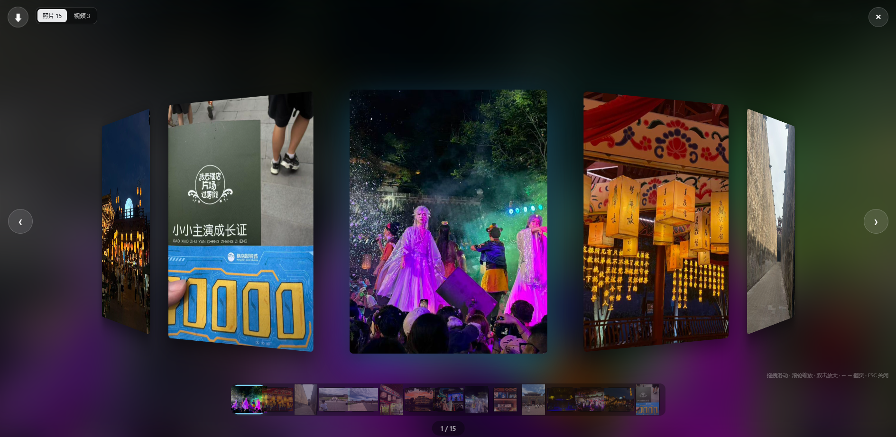](docs/images/attraction-carousel.png) |
| 汇集游玩年月、推荐星级与景点记录，查看各景点的照片和视频。 | 用立体旋转木马浏览景点照片，支持拖动切换、缩放与照片/视频切换。 |

| 旅行轨迹 | 旅途影像 |
| :---: | :---: |
| [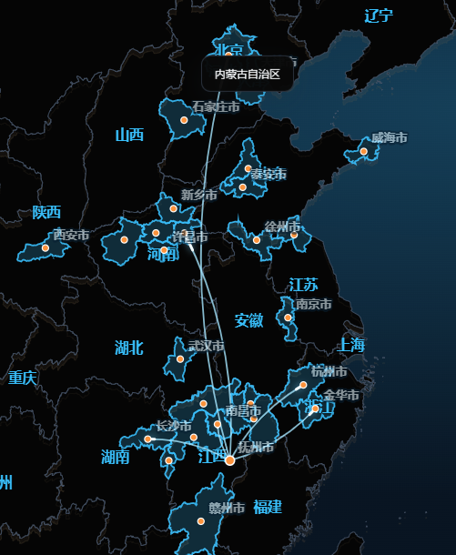](docs/images/travel-routes.png) | [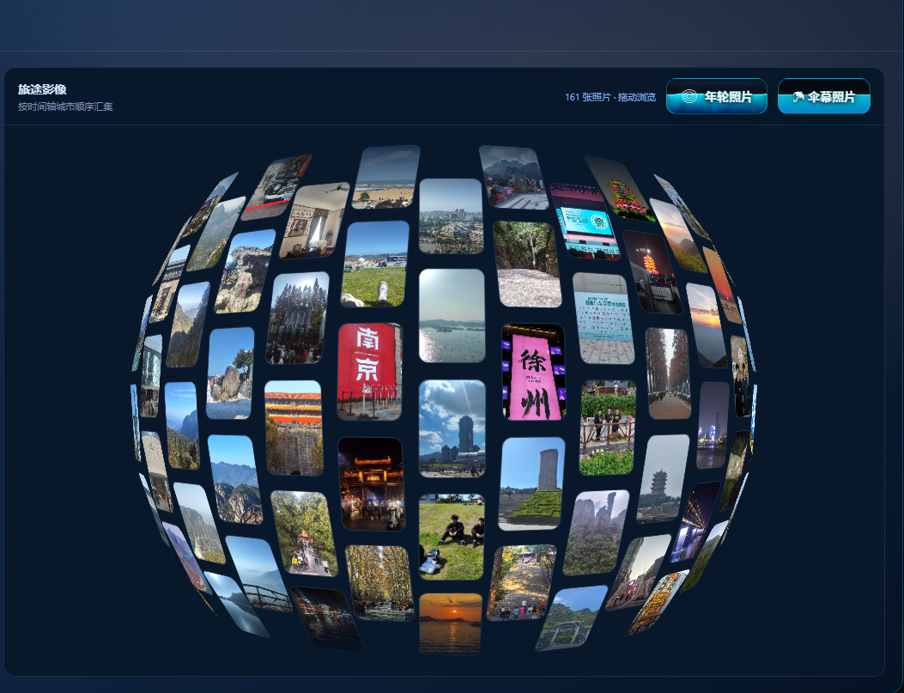](docs/images/travel-timeline.png) |
| 按城市或年份回放路线，从家乡出发，逐年点亮城市轮廓。 | 沿时间轴重温每次到访，在照片球中拖动浏览旅途影像。 |

| 旅行书架 | 年轮照片 |
| :---: | :---: |
| [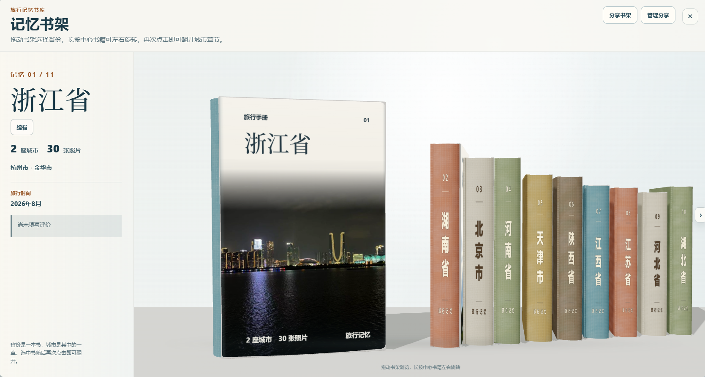](docs/images/memory-shelf.png) | [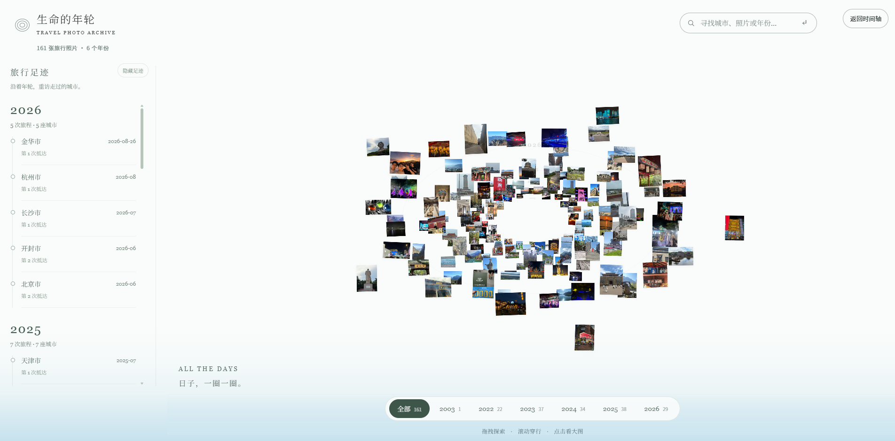](docs/images/image-atlas.png) |
| 每个省份一本书，每座城市一章；翻阅相册，也可分享选中的书架。 | 将照片排成年轮，按年份探索、搜索城市，并点击查看大图。 |

| 光影相册 | 城市照片 |
| :---: | :---: |
| [](docs/images/photo-stream.png) | [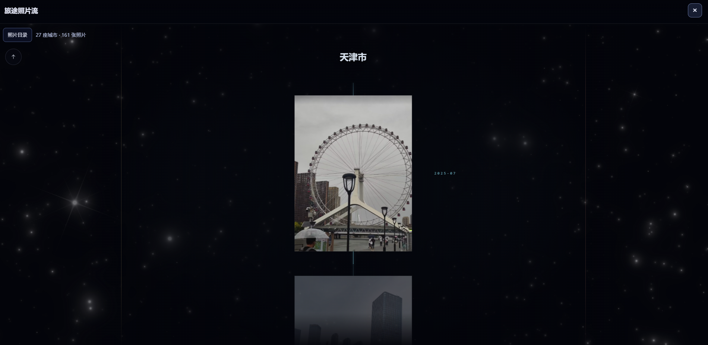](docs/images/city-story.png) |
| 每座城市化作一束光，流动着旅途记忆。 | 走近一座城市，在星空里翻看照片。 |

| 引力相册 | 伞幕照片 |
| :---: | :---: |
| [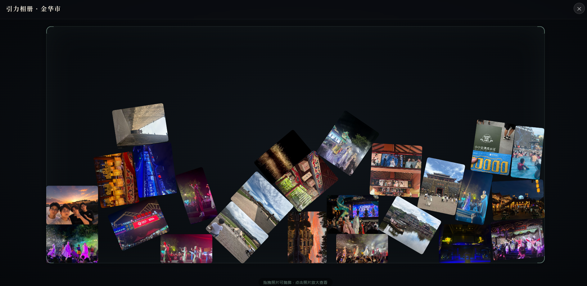](docs/images/gravity-album.png) | [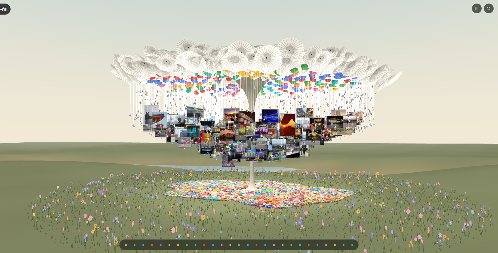](docs/images/umbrella-canopy.png) |
| 照片自由掉落、碰撞与堆叠；拖动摆放，点击放大。 | 在紧凑的伞下花园中收藏旅行影像，按城市浏览悬挂照片；无河流和大片远景地面。 |

### 照片墙

[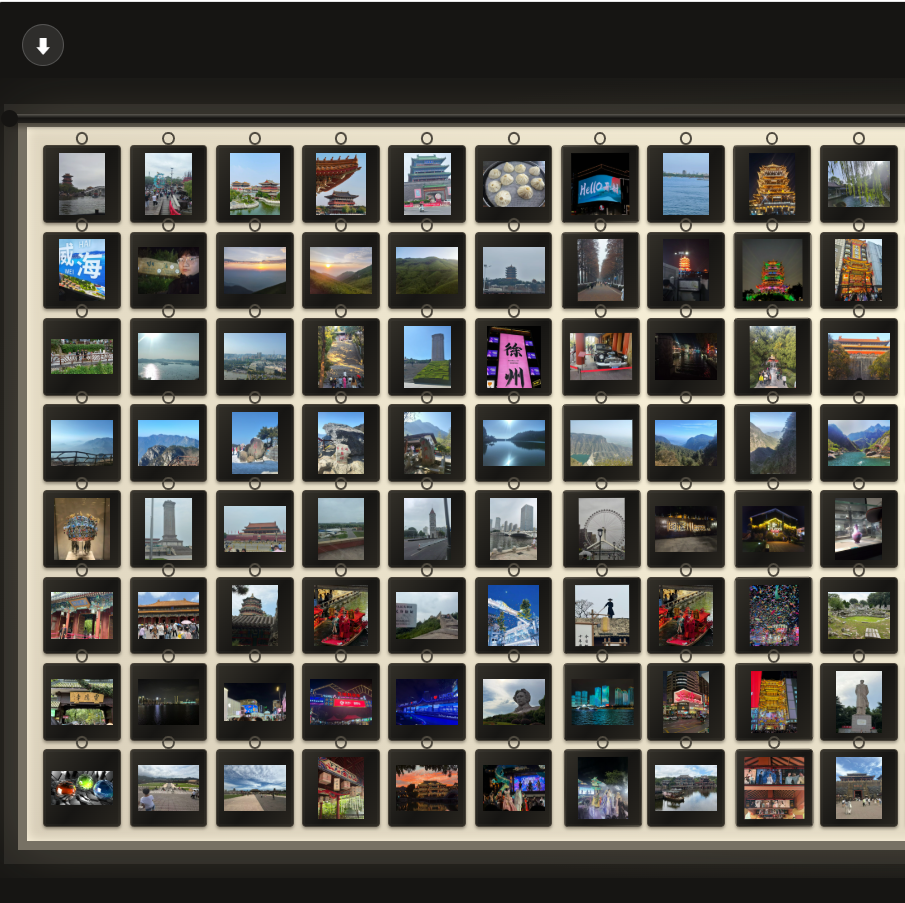](docs/images/photo-wall.png)

把所有城市的照片挂成一面胶片墙。暖色背光、挂环与轻微摆动，点击任意照片即可进入横向浏览。

本机保存资料，也可登录账号同步；视频仅支持本机资料文件夹。

## 最近本地更新 · 2026-10-07

- 地图省市名称采用文艺宋体；已点亮城市名保持完整、不使用省略号。中等放大时避让拥挤名称，缩放达到 5 倍后显示当前画面内全部已点亮名称，缩小后恢复避让；城市标签透明度为 60%。
- 启动页两句文案及左上角标题、文案采用同系列宋体，补齐缺字，保留原字号、颜色和动画。
- 旅行轨迹两个入口取消循环扫光，保留静态光晕和点击功能；菜单名称更新为「旅行书架」「光影相册」。
- 旅行年轮树的底座按年份展示年度城市轨迹，不再逐城巡游或停留三秒；照片圈层仍按空间连续填充。维护记录见 [年轮树说明](assets/travel-ring-tree/README.md)。

以上为本轮更新，网站上线状态以部署结果为准；预览截图可能早于当前代码。

## 本地运行与部署

静态网站，无需前端构建。可用 GitHub Pages、Vercel 或 Docker/Nginx 部署。本地运行：

```bash
python -m http.server 8765
```

打开 [本地页面](http://127.0.0.1:8765/)。云端账号与照片同步需配置 Supabase 和私有 OSS。

[部署说明](docs/DEVELOPMENT.md#部署) · [云端配置](docs/DEVELOPMENT.md#云端账号与跨设备同步)

## 技术与测试

原生 HTML / CSS / JavaScript，使用 ECharts、Three.js、GSAP、Matter.js；IndexedDB 保存本机资料，Supabase 与 OSS 提供云端能力。

```bash
node --test --test-concurrency=1 tests/*.spec.cjs
```

浏览器测试需本机 Playwright 与对应浏览器。按当前用户要求仅运行电脑端测试；上述全套命令包含手机混合用例，不宜直接执行。最新字体、标签与按钮桌面专项 5/5 通过；最近非浏览器回归 32 通过、1 跳过。历史完整回归为 98 通过、1 失败、2 跳过，不代表当前版本全套通过。本次只更新文档，未重跑代码测试；定向命令、已知问题与发布状态见交接文档，不以本地测试代替线上验收。

[技术架构](docs/DEVELOPMENT.md#技术架构) · [测试说明](docs/DEVELOPMENT.md#开发验证) · [当前交接与已知问题](项目交接文档.md)

请勿提交个人旅行备份、账号密钥或临时签名链接；截图仅作界面展示，不包含原始照片库。
